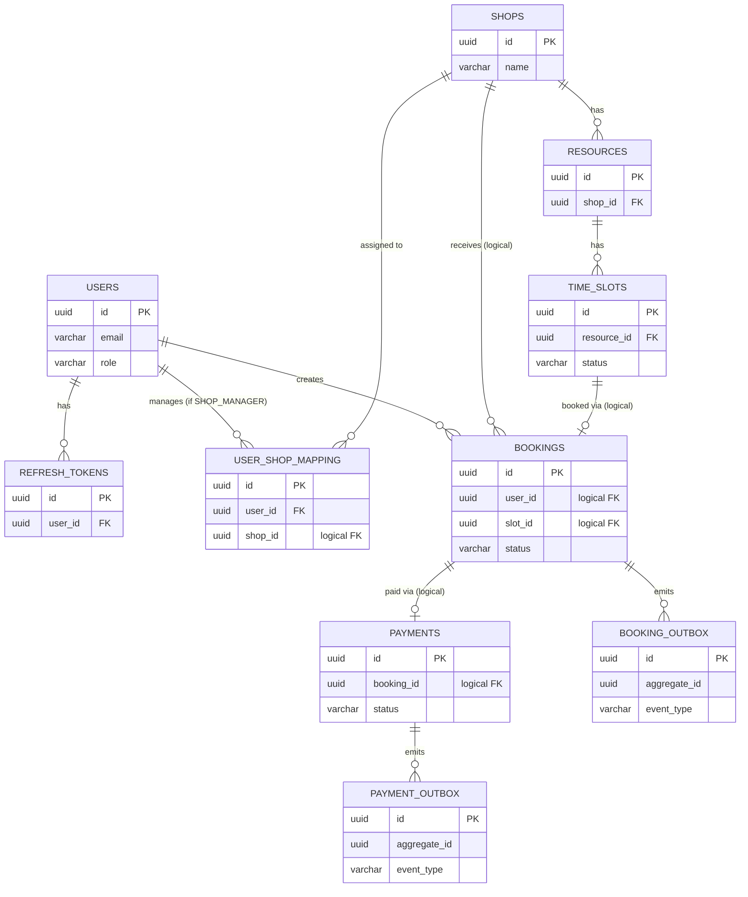

# Booking Platform (Spa) — Database Design

1 RDS PostgreSQL instance, 4 schema tách biệt theo service: `auth_schema`, `venue_schema`, `booking_schema`, `payment_schema`. Không có foreign key vật lý giữa các schema — mọi tham chiếu chéo service (VD: `booking.user_id` trỏ tới `auth.users.id`) là **logical FK**, chỉ validate ở tầng application, không enforce bằng constraint DB. Giữ đúng nguyên tắc loose coupling giữa các service dù chung 1 instance.

---

## 1. `auth_schema`

### `users`
| Cột | Kiểu | Ghi chú |
|---|---|---|
| id | UUID (PK) | |
| email | VARCHAR(255) | UNIQUE, NOT NULL |
| password_hash | VARCHAR(255) | NOT NULL (bcrypt) |
| full_name | VARCHAR(255) | |
| phone | VARCHAR(20) | |
| role | VARCHAR(20) | ENUM: `ADMIN`, `SHOP_MANAGER`, `USER` |
| status | VARCHAR(20) | ENUM: `ACTIVE`, `DISABLED`, default `ACTIVE` |
| created_at | TIMESTAMP | default now() |
| updated_at | TIMESTAMP | |

Index: `UNIQUE(email)`, `INDEX(role)`

### `refresh_tokens`
| Cột | Kiểu | Ghi chú |
|---|---|---|
| id | UUID (PK) | |
| user_id | UUID (FK → users.id) | FK thật vì cùng schema |
| token_hash | VARCHAR(255) | UNIQUE, hash của refresh token (không lưu plaintext) |
| expires_at | TIMESTAMP | |
| revoked | BOOLEAN | default false |
| created_at | TIMESTAMP | |

Index: `INDEX(user_id)`, `INDEX(token_hash)`

### `user_shop_mapping`
| Cột | Kiểu | Ghi chú |
|---|---|---|
| id | UUID (PK) | |
| user_id | UUID (FK → users.id) | FK thật, chỉ user role SHOP_MANAGER |
| shop_id | UUID | **Logical FK** → `venue_schema.shops.id` |
| created_at | TIMESTAMP | |

Index: `UNIQUE(user_id, shop_id)` — 1 manager không được gán trùng 1 shop 2 lần

---

## 2. `venue_schema`

### `shops`
| Cột | Kiểu | Ghi chú |
|---|---|---|
| id | UUID (PK) | |
| name | VARCHAR(255) | NOT NULL |
| address | VARCHAR(500) | |
| description | TEXT | |
| created_by_admin_id | UUID | **Logical FK** → `auth_schema.users.id` |
| status | VARCHAR(20) | ENUM: `ACTIVE`, `INACTIVE` |
| created_at | TIMESTAMP | |
| updated_at | TIMESTAMP | |

### `resources`
| Cột | Kiểu | Ghi chú |
|---|---|---|
| id | UUID (PK) | |
| shop_id | UUID (FK → shops.id) | FK thật, cùng schema |
| name | VARCHAR(255) | VD: "Phòng massage 1", "KTV Linh" |
| type | VARCHAR(20) | ENUM: `ROOM`, `STAFF`, `EQUIPMENT` |
| created_at | TIMESTAMP | |

Index: `INDEX(shop_id)`

### `time_slots`
| Cột | Kiểu | Ghi chú |
|---|---|---|
| id | UUID (PK) | |
| shop_id | UUID (FK → shops.id) | denormalize để query nhanh, tránh join resources |
| resource_id | UUID (FK → resources.id) | |
| start_time | TIMESTAMP | |
| end_time | TIMESTAMP | |
| price | DECIMAL(10,2) | |
| status | VARCHAR(20) | ENUM: `AVAILABLE`, `LOCKED`, `BOOKED` |
| created_at | TIMESTAMP | |
| updated_at | TIMESTAMP | |

Index: `UNIQUE(resource_id, start_time)` — 1 resource không thể có 2 slot trùng giờ bắt đầu
Index: `INDEX(shop_id, start_time, status)` — phục vụ query "slot trống của shop X ngày Y"

---

## 3. `booking_schema`

### `bookings`
| Cột | Kiểu | Ghi chú |
|---|---|---|
| id | UUID (PK) | |
| user_id | UUID | **Logical FK** → `auth_schema.users.id` |
| shop_id | UUID | **Logical FK** → `venue_schema.shops.id` |
| slot_id | UUID | **Logical FK** → `venue_schema.time_slots.id` |
| status | VARCHAR(20) | ENUM: `PENDING`, `CONFIRMED`, `CANCELLING`, `CANCELLED` |
| amount | DECIMAL(10,2) | copy giá tại thời điểm đặt (không phụ thuộc giá slot đổi sau này) |
| expires_at | TIMESTAMP | dùng cho job tự hủy PENDING quá hạn |
| created_at | TIMESTAMP | |
| updated_at | TIMESTAMP | |

Index: `INDEX(user_id)`, `INDEX(slot_id)`, `INDEX(status, expires_at)` — phục vụ scheduled job quét booking hết hạn

### `outbox_events`
| Cột | Kiểu | Ghi chú |
|---|---|---|
| id | UUID (PK) | |
| aggregate_id | UUID | booking_id liên quan |
| event_type | VARCHAR(50) | VD: `BOOKING_CREATED`, `BOOKING_CONFIRMED`, `BOOKING_CANCELLED` |
| payload | JSONB | nội dung event đầy đủ |
| status | VARCHAR(20) | ENUM: `PENDING`, `SENT` |
| created_at | TIMESTAMP | |
| sent_at | TIMESTAMP | NULL cho tới khi relay job gửi thành công |

Index: `INDEX(status, created_at)` — phục vụ relay job quét theo batch

---

## 4. `payment_schema`

### `payments`
| Cột | Kiểu | Ghi chú |
|---|---|---|
| id | UUID (PK) | |
| booking_id | UUID | **Logical FK** → `booking_schema.bookings.id` |
| stripe_payment_intent_id | VARCHAR(255) | UNIQUE |
| amount | DECIMAL(10,2) | |
| currency | VARCHAR(10) | VD: `usd` (Stripe test mode) |
| status | VARCHAR(20) | ENUM: `REQUIRES_PAYMENT`, `SUCCEEDED`, `FAILED`, `REFUNDED` |
| created_at | TIMESTAMP | |
| updated_at | TIMESTAMP | |

Index: `UNIQUE(stripe_payment_intent_id)`, `INDEX(booking_id)`

### `outbox_events`
Cấu trúc giống hệt `booking_schema.outbox_events`, chỉ khác `event_type` (VD: `PAYMENT_SUCCEEDED`, `PAYMENT_FAILED`, `REFUND_SUCCEEDED`).

---

## 5. Sơ đồ quan hệ tổng thể (ERD, gồm cả logical FK xuyên schema)

---

## 6. Lưu ý khi implement (Flyway)

- Mỗi service chỉ chạy migration cho **schema của chính nó**, KHÔNG được viết migration đụng vào schema khác — kể cả khi cùng 1 RDS instance
- Đặt `default_schema` riêng cho từng service trong `application.yml` (Flyway `schemas:` config + JPA `default_schema` hoặc `hibernate.default_schema`)
- Naming convention migration: `V{version}__{mo_ta}.sql`, ví dụ `V1__create_users_table.sql`
- Vì `shop_id`, `user_id`, `slot_id`, `booking_id` giữa các schema là **logical FK**, validate tồn tại bằng cách gọi REST sang service sở hữu (VD: booking-service gọi venue-service kiểm tra `slot_id` tồn tại và còn `AVAILABLE` trước khi tạo booking), không dựa vào DB constraint
